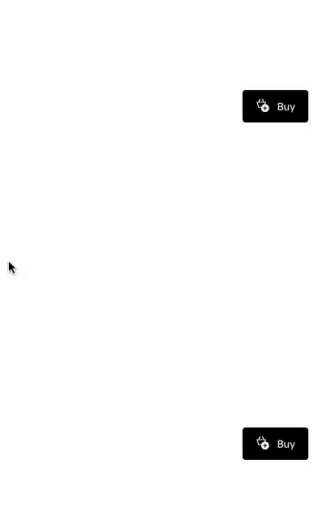
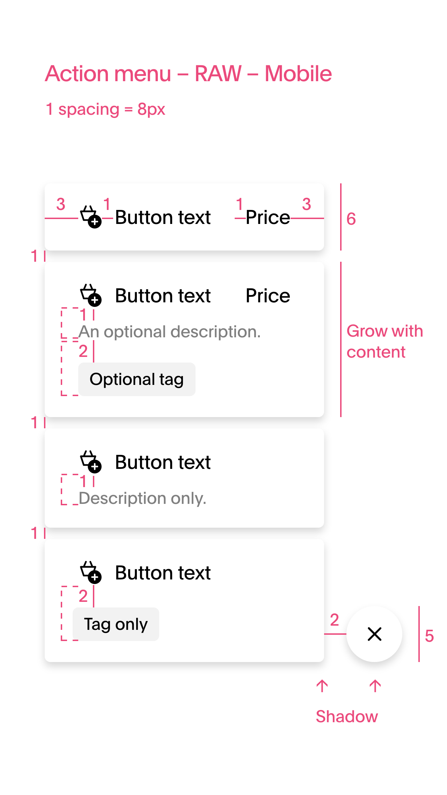
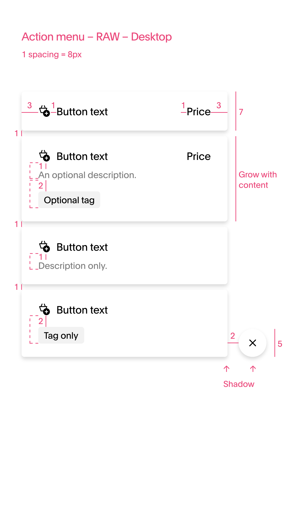

# Scentronix Design System Test

## Test Requirements

We want you to create this component using the following tools:

[](design-system.gif)
[](design-system-mobile.png)
[](./public/design-system-desktop.png)

Everything is done through git, so to share this project we would like you to send us a git repo on for example like Github/Gitlab etc.

We would like you to use [Storybook](https://storybook.js.org/) as a start for this assignment, and in our apps we use [Material-UI](https://material-ui.com]) as a base for our components.

Create a few pages like this with different kind of text and link them together in the menu.

Have MUI as a base for the components and incorperate the best way to have the animations how its shown in the design.

Have the component be responsive on Desktop and Mobile

Icons you can use either random from the internet or other packages.

#### What are we expecting:

- Neatly written and formatted code for production level environment (scalability in mind)
- Demonstration of knowledge on libary setup eg. MUI
- Demonstration of knowledge on React
- Demonstration of knowledge on Typescript
- Demonstration of Storybook best practices
- Demonstration of Design System best practices
- Demonstration of Responsiveness
- Impress us with the skills you have


## Prerequisites
Node version: >= 18

## Start With StoryBook

First, install dependencies:

```bash
npm install
# or
yarn
```

Then:

```bash
npm run storybook
# or
yarn storybook
```
